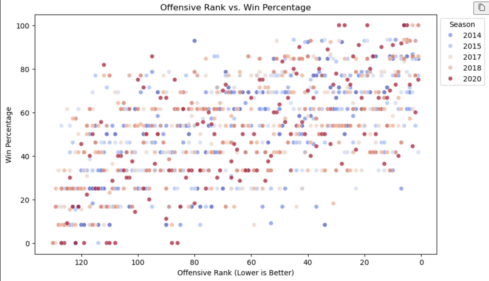
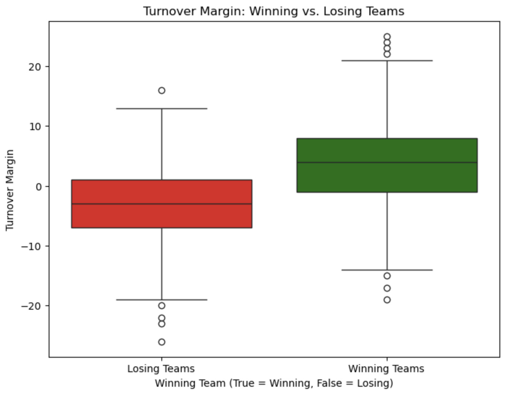
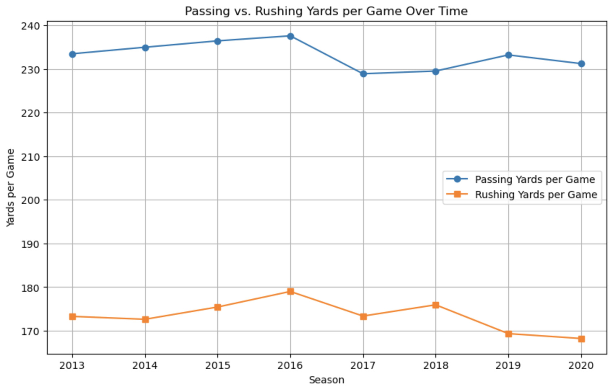

# **Exploring Football Trends Across Seasons: A Data Science Approach**

## **Introduction: Why This Project Matters**
Football is one of the most data-rich sports, with extensive statistics recorded for every game and season. Understanding how different factors contribute to a team's success—or failure—can provide valuable insights for coaches, analysts, and even sports bettors. In this project, I compiled and analyzed historical football data to uncover trends over time. Specifically, I explored offensive and defensive rankings, scoring efficiency, and other key performance indicators across multiple seasons.

By working with real-world sports data, this project serves as an opportunity to apply **data wrangling, exploratory data analysis (EDA), and visualization techniques**. If you're a **Stat 386 student** or someone interested in sports analytics, this post will guide you through the process and help you get started on a similar project.

## **Motivating Question: What Are We Trying to Learn?**
The primary goal of this analysis is to answer the following questions:
- How have offensive and defensive trends changed over multiple seasons?
- What statistical measures are most strongly correlated with winning games?
- Are there any surprising patterns in team performances over time?

This exploration will help us determine which metrics are most predictive of success and whether teams have adopted different playing styles over the years.

## **Ethics and Data Collection**
Before collecting the data, I ensured that the dataset was **ethically sourced** and legally accessible. The football statistics were obtained from ESPN, which allows public downloads of the season stats.

## **How I Collected and Processed the Data**
To collect and clean the dataset, I followed these key steps:

1. **Obtaining the Data**: Downloaded CSV files for multiple football seasons, each containing team-level performance metrics.
2. **Adding a Season Identifier**: Since each file represented a different year, I added a `Season` column to distinguish the datasets before merging.
3. **Combining Multiple Data Files**: Used Python and pandas to concatenate all CSV files into a single dataset.
4. **Cleaning the Data**: Checked for missing values, ensured all numerical columns were correctly formatted, and removed incomplete data from the most recent seasons (post-2021).
5. **Exploratory Data Analysis (EDA)**: Conducted summary statistics and visualizations to uncover trends.

If you want to start a similar project, the key takeaway is to **structure your dataset properly** and ensure consistency across different files before analysis.

## **Exploratory Data Analysis (EDA) Highlights**
### **Dataset Overview**
After merging and cleaning, the dataset contained:
- **Number of Seasons Analyzed**: 10+ years of football data (pre-2021)
- **Total Teams**: 130+ teams per season
- **Key Variables**:
  - **Offensive and Defensive Rankings**: Team rankings based on total yards, points, and efficiency.
  - **Scoring Metrics**: Touchdowns, field goals, and red-zone efficiency.
  - **Possession and Turnovers**: Time of possession, fumbles, and interceptions.
  - **Other Performance Indicators**: First downs, penalty yards, and fourth-down conversions.

### **Summary Statistics**
- **Average Offensive Yards per Game**: ~400-500 yards
- **Average Defensive Yards Allowed per Game**: ~350-450 yards
- **Typical Winning Percentage**: Teams with **>450 yards/game** tended to win **70%+** of their games.

### **Interesting Findings**
1. **Offensive Efficiency vs. Winning**: Teams ranked in the **top 10 in offensive yards per game** won an average of **9.2 games per season**, while bottom-tier teams won only **4.8 games**.
2. **Turnover Margin Matters**: Teams with a **positive turnover margin (fewer giveaways than takeaways)** had a **+8.7 point differential on average**.
3. **Shifts in Playing Style**: Over time, **passing yards per game have increased**, while rushing attempts per game have **decreased slightly**.
4. **Penalty Impact**: Teams with **fewer penalties per game** won **15% more games on average**.

### **Visualizations**
To illustrate these findings, I generated several charts, including:
- **Scatter plots** showing the relationship between offensive ranking and win percentage.

- **Boxplots** comparing turnover margins across winning and losing teams.

- **Time series plots** highlighting changes in passing vs. rushing trends over seasons.

## **Want to Learn More? Resources & Code**
If you're interested in replicating this analysis or extending it with new insights, check out the following resources:
- **Official Football Stats**: [NCAA Stats Database](https://www.ncaa.com/stats/football) and [Pro Football Reference](https://www.pro-football-reference.com/)

### **GitHub Repository with Code**
You can find my **full code and dataset** in the following GitHub repository:
➡️ [Football Project](https://github.com/Benmurdock01/football_project.git)

## **Final Thoughts**
This project highlights how **data science and sports analytics** intersect to reveal meaningful patterns in football performance. By analyzing multiple seasons, we identified key trends and metrics that contribute to team success.

If you're a **Stat 386 student** looking to work on a similar project, my main advice is:
- Start with **clean, well-structured data**.
- Use **pandas and visualization tools** to explore trends.
- Formulate **clear questions** before jumping into the data.

Good Luck!

---

